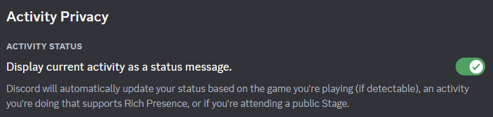

# exy


[Emby](https://emby.media)/[Jellyfin](https://jellyfin.org) companion app to provide [Discord](https://discord.com) rich presence.

TODO Images

# State of this application

As of 2024, me and some friends are using exy on Windows.
MacOS and Linux builds are created, but untested. Feedback appreciated.

## Features

- Supports all media types.
- Show playing/paused/muted state.
- Add multiple media-servers.
- Option to hide media-server type in Discord.
- Preview images using Imgur.
- Detect [public content](#public-content) from [YouTube](https://www.youtube.com) and [BitChute](https://www.bitchute.com) and provide link in activity.

## Requirements

Discord setting "Display current activity as a status message." needs to be enabled.

This setting can be found in "Discord settings" -> "Activity Privacy".

## Public content

In case you watch local copies of YouTube or BitChute content, exy can detect the original video and link it in your activity.
This is done using the file path of the playing item.

The file path must meet two conditions for this feature to work:

1. Contains site name `YouTube` or `BitChute` (case insensitive).
2. Followed by a video ID in brackets `[]`.

If a video is detected, a link will be generated and checked. This avoids adding links to deleted or otherwise unavailable videos.

Examples:

- `/media/YouTube/Me at the zoo [jNQXAC9IVRw].mp4`
- `/media/youtube/[jNQXAC9IVRw] Me at the zoo.mp4`
- `/media/youtube.com/Me at the zoo [jNQXAC9IVRw].mp4`
- `/media/YouTube Me at the zoo [jNQXAC9IVRw].mp4`
- `/media/BitChute/Me at the zoo [0aG6W5lcsJG3].mp4`

Try your path with RegEx101:

- [YouTube](https://regex101.com/r/6J9dr9/1)
- [BitChute](https://regex101.com/r/cpVE7k/1)

# Development

## Recommended IDE Setup

- [VSCode](https://code.visualstudio.com/) + [ESLint](https://marketplace.visualstudio.com/items?itemName=dbaeumer.vscode-eslint) + [Prettier](https://marketplace.visualstudio.com/items?itemName=esbenp.prettier-vscode) + [Svelte](https://marketplace.visualstudio.com/items?itemName=svelte.svelte-vscode)

## Project Setup

### Install

```bash
$ npm install
```

### Development

```bash
$ npm run dev
```

### Build

```bash
# For windows
$ npm run build:win

# For macOS
$ npm run build:mac

# For Linux
$ npm run build:linux
```

## Discord application

A Discord application for exy is already setup. Changing the application is only required if you want to change the "game played" displayed in Discord or some art assets. Running exy locally and/or a custom build is necessary to apply another application ID.

### Using another Discord application

A new application can be created in the [Discord developer portal](https://discord.com/developers/applications).
The application ID used by exy can be changed in the [environment.json](src/environment.json) file.

### Art assets

All art assets are stored in [resources/discord-art-assets/](resources/discord-art-assets/).

Assets need to be uploaded in the application settings -> "Rich Presence" -> "Art Assets":

