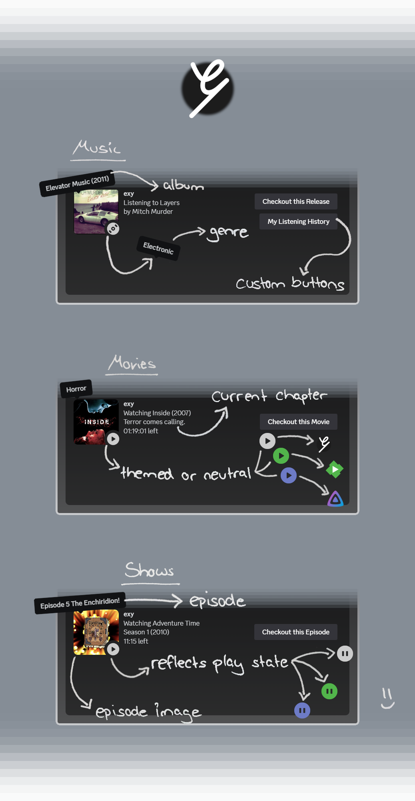

[Emby](https://emby.media)/[Jellyfin](https://jellyfin.org) companion app to provide [Discord](https://discord.com) rich presence.

- Easy to setup via UI
- Preview images using Imgur
- All media types supported
- Showing play state (pause, time remaining, current chapter)
- Ignore media types and customize what is shared
- Login with your regular user, no Emby/Jellyfin API key required
- Detect YouTube/BitChute content and link to original video

# Setup

https://github.com/xyxxyxxy/exy/assets/7705456/8dff2e70-5a59-41c2-ae0d-bad2e1a5c113

Follow the instructions in the UI to connect your media-server and add an Imgur client ID. Play something in Emby/Jellyfin and exy will update your Discord status.

## Download

Installers can be downloaded from the [release page](https://github.com/xyxxyxxy/exy/releases/latest).

## Requirements

Discord client must run on the same machine.

### Discord settings

"Display current activity as a status message." needs to be enabled.

Can be found in "Discord settings" -> "Activity Privacy".

# Development

## Recommended IDE Setup

- [VSCode](https://code.visualstudio.com/) + [ESLint](https://marketplace.visualstudio.com/items?itemName=dbaeumer.vscode-eslint) + [Prettier](https://marketplace.visualstudio.com/items?itemName=esbenp.prettier-vscode) + [Svelte](https://marketplace.visualstudio.com/items?itemName=svelte.svelte-vscode)

## Project Setup

### Install

```bash
$ npm install
```

### Development

```bash
$ npm run dev
```

### Build

```bash
# For windows
$ npm run build:win

# For macOS
$ npm run build:mac

# For Linux
$ npm run build:linux
```

## Discord application

A Discord application for exy is already setup. Changing the application is only required if you want to change the "game played" displayed in Discord or some art assets. Running exy locally and/or a custom build is necessary to apply another application ID.

### Using another Discord application

A new application can be created in the [Discord developer portal](https://discord.com/developers/applications).
The application ID used by exy can be changed in the [environment.json](src/environment.json) file.

### Art assets

All art assets are stored in [resources/discord-art-assets/](resources/discord-art-assets/).

Assets need to be uploaded in the application settings -> "Rich Presence" -> "Art Assets":


## Emby API client

The Emby API client is generated using `npm run generate-emby-client`.

A local copy of the Emby OpenAPI configuration is used, so builds are reproducible.
To get the latest version of the OpenAPI JSON from your Emby server, click the API link on the admin dashboard page, like described [here](https://dev.emby.media/doc/restapi/index.html#emby-api-browser).

# Code Dependency Upgrade Notes

To upgrade `electron-store` to [version 9](https://github.com/sindresorhus/electron-store/releases/tag/v9.0.0) or higher the following config is required in `tsconfig.node.json`, because `electron-store` was converted into an ESM:

```
  "compilerOptions": {
    "target": "ESNext",
    "module": "NodeNext",
    "moduleResolution": "NodeNext",
```

And `"type": "module"` needs to be added in the `package.json`.

This means that [imports need to be updated](https://gist.github.com/sindresorhus/a39789f98801d908bbc7ff3ecc99d99c#how-can-i-make-my-typescript-project-output-esm) in the project:

> You must use a .js extension in relative imports even though you're importing .ts files.

The generated emby client in `./src/main/core/emby-client` does not work as ESM yet and a workaround using [fix-esm-import-path](https://www.npmjs.com/package/fix-esm-import-path) did not work.
